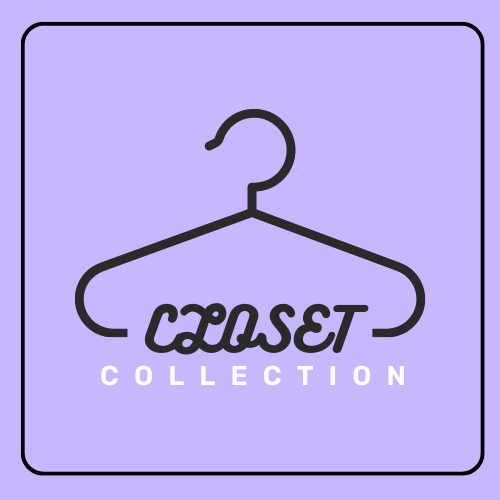
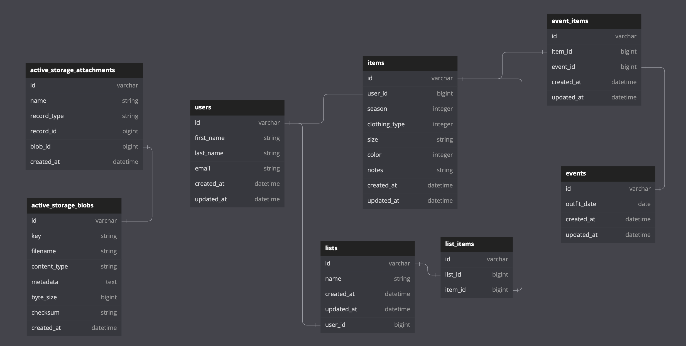

<div id="header" align="center"> 

</div>

# <p align="center"> :shirt:Closet Collection:womans_clothes: </p>

This application exposes backend endpoints for our frontend application to consume. Working in a service-oriented architecture, the frontend will communicate with this application by consuming our API in order to build an application that allows users to organize their closet.

You can find our Frontend Repo: [Here](https://github.com/closet-manager/closet-manager-fe) 

Visit our Apps and Presentation:<br>
- Backend: [Heroku](https://closet-manager-be.herokuapp.com/)<br>
- Frontend: [Vercel](https://closet-manager-fe.vercel.app/)<br>
- Closet Collection was nominated amongst peers and instructors to participate in Turing School of Software & Design's bi-quarterly demo competition, where we placed second.<br>
  - View our Demo Comp Video [here](https://www.youtube.com/watch?v=0hlVi5rcZs0)

This project follows guidelines set in place by Turing School of Software & Design. For more information on project requirements: [Capstone Project](https://mod4.turing.edu/projects/capstone/)

      


## :information_source:About Closet Collection

Closet Collection is your ultimate solution to organize your wardrobe. With this app, you can easily manage your clothing collection, take photos of your clothing items, create custom lists for trips or general organization, preselect items to create outfits for specific dates, favorite items, and categorize your wardrobe by color, season, clothing type, and favorites for easy filtering. Closet Collection allows you to easily access your preselected outfit using the calendar feature, eliminating the hassle of choosing an outfit for a special occasion. You can add notes to your clothing items, such as if you have lent an item to a friend or if it is at the dry cleaners. In addition, you can create personalized lists for events or trips, and add items to the list as packing reminders. Finally, if you ever need to make changes, you can easily delete items from your closet or from a list. Say goodbye to cluttered closets and disorganized trips, and say hello to the perfect wardrobe management tool with Closet Collection.

## :computer:Technologies
- Rails 5.2.8
- Ruby 2.7.4
- Gems:gem::
  - AWS SDK S3 | Action Mailer | jsonapi-serializer | dotenv-rails | factory_bot_rails | faker | shoulda-matchers | simplecov | rspec-rails | rack-cors
- AWS S3
- AWS SES
- CI with GitHub Actions
- Active Storage 
- Postman
- Heroku


## :heavy_check_mark:Installation
1. Fork and clone this repository
2. `cd` into the root directiory
3. `bundle install`
4. `rails db:{drop,create,migrate}`
5. Run the test suite with `bundle exec rspec`
6. Start the local server by running `rails s`
7. Visit the app on `localhost:5000` in your web browser

## :round_pushpin:Endpoints
Click here to see our Postman Collection:  [](https://app.getpostman.com/run-collection/25494899-73251b13-9df8-42d5-9d84-d95eb95079c2?action=collection%2Ffork&collection-url=entityId%3D25494899-73251b13-9df8-42d5-9d84-d95eb95079c2%26entityType%3Dcollection%26workspaceId%3D59c0ff8b-95ac-46d0-b877-d629dfd7be75)

<details close>

### Get a User


```http
GET /api/v1/users/:id
```

<details close>
<summary>  Details </summary><br>
This endpoint returns a user
<br><br>
    
Parameters: <br>
```
None
```

| Code | Description |
| :--- | :--- |
| 200 | `OK` |

Example Value:

```json

{
    "data": {
        "id": "1",
        "type": "user",
        "attributes": {
            "first_name": "Brax",
            "last_name": "Eddings",
            "email": "test22@turing.edu"
        }
    }
}

```

</details>

---

### Get all Items
```http
GET "/api/v1/users/:user_id/items"
```

<details close>
<summary>  Details </summary><br>
This endpoint returns all of a user's clothing items
<br><br>
    
Parameters: <br>
```
None
```

| Code | Description |
| :--- | :--- |
| 200 | `OK` |

Example Value:

```json
{
    "data": [
        {
            "id": "1",
            "type": "item",
            "attributes": {
                "user_id": 1,
                "season": "all_season",
                "clothing_type": "accessories",
                "color": "black",
                "size": "unisex",
                "image_url": "http://localhost:5000/rails/active_storage/blobs/eyJfcmFpbHMiOnsibWVzc2FnZSI6IkJBaHBCZz09IiwiZXhwIjpudWxsLCJwdXIiOiJibG9iX2lkIn19--8e3415ed60f7cd82422e28d1bde574bd363be56b/default-image.jpeg",
                "notes": "worn",
                "favorite": true
            }
        },
        {
            "id": "2",
            "type": "item",
            "attributes": {
                "user_id": 1,
                "season": "fall",
                "clothing_type": "shoes",
                "color": "red",
                "size": "12",
                "image_url": "http://localhost:5000/rails/active_storage/blobs/eyJfcmFpbHMiOnsibWVzc2FnZSI6IkJBaHBCdz09IiwiZXhwIjpudWxsLCJwdXIiOiJibG9iX2lkIn19--b31bf7735fbf690cc430df1a72be219350abbfe6/default-image.jpeg",
                "notes": "updated",
                "favorite": false
            }
        }
    ]
}
```

</details>

---

### Get One Item
```http
GET "/api/v1/users/:user_id/items/:item_id"
```

<details close>
<summary>  Details </summary><br>
This endpoint returns one specific clothing item for a user
<br><br>
    
Parameters: <br>
```
None
```

| Code | Description |
| :--- | :--- |
| 200 | `OK` |

Example Value:

```json
{
    "data": {
        "id": "1",
        "type": "item",
        "attributes": {
            "season": "all season",
            "clothing_type": "other",
            "size": "Large",
            "color": "red",
            "image_url": "http://localhost:5000/rails/active_storage/blobs/eyJfcmFpbHMiOnsibWVzc2FnZSI6IkJBaHBDZz09IiwiZXhwIjpudWxsLCJwdXIiOiJibG9iX2lkIn19--7a80867ed962af9718e097d1d7233e3499806a3d/IMG_7868.jpg",
            "notes": "Hand wash only",
            "favorite": false
        }
    }
}
```

</details>

---

### Get One Item based off a category
```http
GET "/api/v1/users/:id/items/find_all?clothing_type=<clothing_type>&color=<color>&season=<season>&favorite=<true>"
```

<details close>
<summary>  Details </summary><br>
This endpoint returns one specific clothing item from a user based off a specified category
<br><br>
    
Parameters: <br>
```
clothing_type = shoes
```

| Code | Description |
| :--- | :--- |
| 200 | `OK` |

Example Value:

```json
{
    "data": [
        {
            "id": "36",
            "type": "item",
            "attributes": {
                "user_id": 1,
                "season": "fall",
                "clothing_type": "shoes",
                "color": "black",
                "size": "7",
                "image_url": "https://closet-manager-be.herokuapp.com/rails/active_storage/blobs/eyJfcmFpbHMiOnsibWVzc2FnZSI6IkJBaHBKZz09IiwiZXhwIjpudWxsLCJwdXIiOiJibG9iX2lkIn19--c5dcf33990f9535c749ff5729b2aac29cbe8875b/blackshoes.png",
                "notes": "brand new in box",
                "favorite": true
            }
        },
        {
            "id": "7",
            "type": "item",
            "attributes": {
                "user_id": 1,
                "season": "fall",
                "clothing_type": "shoes",
                "color": "red",
                "size": "12",
                "image_url": "https://closet-manager-be.herokuapp.com/rails/active_storage/blobs/eyJfcmFpbHMiOnsibWVzc2FnZSI6IkJBaHBDdz09IiwiZXhwIjpudWxsLCJwdXIiOiJibG9iX2lkIn19--4a0bb858ff6fb906e9610c410adf84eda723d1bd/blackshoes.png",
                "notes": "recently cleaned",
                "favorite": true
            }
        }
    ]
}
```

</details>

---

### Create an Item
```http
POST "/api/v1/users/:user_id/items"
```

<details close>
<summary>  Details </summary><br>
This endpoint creates a user's clothing item
<br><br>
    
Parameters: <br>
```
CONTENT_TYPE=multipart/form-data
```

| Code | Description |
| :--- | :--- |
| 201 | `CREATED` |

Example Value:

```json
{
    "data": {
        "id": "5",
        "type": "item",
        "attributes": {
            "user_id": 1,
            "season": "fall",
            "clothing_type": "shoes",
            "color": "black",
            "size": "7",
            "image_url": "http://localhost:5000/rails/active_storage/blobs/eyJfcmFpbHMiOnsibWVzc2FnZSI6IkJBaHBDZz09IiwiZXhwIjpudWxsLCJwdXIiOiJibG9iX2lkIn19--7a80867ed962af9718e097d1d7233e3499806a3d/IMG_7868.jpg",
            "notes": "brand new in box",
            "favorite": false
        }
    }
}
```

</details>

---

### Update an Item
```http
PATCH "/api/v1/users/:user_id/items/:item_id"
```

<details close>
<summary>  Details </summary><br>
This endpoint updates a user's clothing item
<br><br>
    
Parameters: <br>
```
{
    "item": {
              "season": "fall",
              "color": "red",
              "clothing_type": "shoes",
              "size": "12",
              "notes": "updated",
              "favorite": false
            }
}
```

| Code | Description |
| :--- | :--- |
| 200 | `OK` |

Example Value:

```json
{
    "data": {
        "id": "1",
        "type": "item",
        "attributes": {
            "user_id": 1,
            "season": "fall",
            "clothing_type": "shoes",
            "color": "red",
            "size": "12",
            "image_url": "http://localhost:5000/rails/active_storage/blobs/eyJfcmFpbHMiOnsibWVzc2FnZSI6IkJBaHBCZz09IiwiZXhwIjpudWxsLCJwdXIiOiJibG9iX2lkIn19--8e3415ed60f7cd82422e28d1bde574bd363be56b/default-image.jpeg",
            "notes": "updated",
            "favorite": false
        }
    }
}
```

</details>


---

### Delete an Item

```http
DELETE /api/v1/users/:user_id/items/:item_id
```

<details close>
<summary>  Details </summary>
This endpoint deletes a user's clothing item
<br><br>
    
Parameters: <br>
```
None
```

| Code | Description |
| :--- | :--- |
| 204 | No Content |

Example Value:

```json
{
    "message": "Item has been successfully deleted"
}
```

</details>

---

### Get all Lists
```http
GET /api/v1/users/:user_id/lists
```


<details close>
<summary>  Details </summary><br>
This endpoint returns all of a user's lists
<br><br>
    
Parameters: <br>
```
None
```

| Code | Description |
| :--- | :--- |
| 200 | `OK` |

Example Value:

```json
{
    "data": [
        {
            "id": "5",
            "type": "list",
            "attributes": {
                "name": "Bora Bora Trip",
                "user_id": 1,
                "items": []
            }
        },
        {
            "id": "6",
            "type": "list",
            "attributes": {
                "name": "Paris Trip",
                "user_id": 1,
                "items": []
            }
        },
        {
            "id": "7",
            "type": "list",
            "attributes": {
                "name": "2 weeks - Tokyo Trip",
                "user_id": 1,
                "items": []
            }
        },
        {
            "id": "8",
            "type": "list",
            "attributes": {
                "name": "Hiking in Laos",
                "user_id": 1,
                "items": []
            }
        },
    ]
}
```

</details>

---

### Get one List
```http
GET "/api/v1/users/:user_id/lists/:list_id"
```

<details close>
<summary>  Details </summary><br>
This endpoint returns a one specific list of user
<br><br>
    
Parameters: <br>
```
None
```

| Code | Description |
| :--- | :--- |
| 200 | `OK` |

Example Value:

```json
{
    "data": {
        "id": "1",
        "type": "list",
        "attributes": {
            "name": "Bachelorette Party",
            "user_id": 1,
            "items": []
        }
    }
}
```

</details>

---

### Get all Items for a List
```http
GET "/api/v1/users/:user_id/lists/:list_id/items"
```

<details close>
<summary>  Details </summary><br>
This endpoint returns all items from one specific list of a user
<br><br>
    
Parameters: <br>
```
None
```

| Code | Description |
| :--- | :--- |
| 200 | `OK` |

Example Value:

```json
{
    "data": [
        {
            "id": "2",
            "type": "item",
            "attributes": {
                "user_id": 1,
                "season": "fall",
                "clothing_type": "shoes",
                "color": "red",
                "size": "12",
                "image_url": "http://localhost:5000/rails/active_storage/blobs/eyJfcmFpbHMiOnsibWVzc2FnZSI6IkJBaHBCdz09IiwiZXhwIjpudWxsLCJwdXIiOiJibG9iX2lkIn19--b31bf7735fbf690cc430df1a72be219350abbfe6/default-image.jpeg",
                "notes": "updated",
                "favorite": false
            }
        },
        {
            "id": "1",
            "type": "item",
            "attributes": {
                "user_id": 1,
                "season": "all_season",
                "clothing_type": "accessories",
                "color": "black",
                "size": "unisex",
                "image_url": "http://localhost:5000/rails/active_storage/blobs/eyJfcmFpbHMiOnsibWVzc2FnZSI6IkJBaHBCZz09IiwiZXhwIjpudWxsLCJwdXIiOiJibG9iX2lkIn19--8e3415ed60f7cd82422e28d1bde574bd363be56b/default-image.jpeg",
                "notes": "worn",
                "favorite": false
            }
        }
    ]
}
```

</details>

---

### Create a List
```http
POST "/api/v1/users/:user_id/lists"
```

<details close>
<summary>  Details </summary><br>
This endpoint creates a user's list
<br><br>
    
Parameters: <br>
```
{
    "list": {
        "name": "Bachelorette Party"
    }
}
```

| Code | Description |
| :--- | :--- |
| 201 | `CREATED` |

Example Value:

```json
{
    "data": {
        "id": "1",
        "type": "list",
        "attributes": {
            "name": "Bachelorette Party",
            "user_id": 1,
            "items": []
        }
    }
}
```

</details>

---

### Delete a List

```http
DELETE /api/v1/users/:user_id/lists/:list_id
```

<details close>
<summary>  Details </summary>
This endpoint deletes a user's specific list
<br><br>
    
Parameters: <br>
```
None
```

| Code | Description |
| :--- | :--- |
| 204 | No Content |

Example Value:

```json
{
    "message": "List has been successfully deleted"
}
```

</details>

---

### Create a List Item
```http
POST "/api/v1/items/:item_id/lists/:list_id/list_items"
```

<details close>
<summary>  Details </summary><br>
This endpoint creates a an item for a user's list
<br><br>
    
Parameters: <br>
```
None
```

| Code | Description |
| :--- | :--- |
| 201 | `CREATED` |

Example Value:

```json
{
    "message": "Item has been successfully added to list"
}
```

</details>

--- 

### Delete a List Item

```http
DELETE /api/v1/items/:item_id/lists/:list_id
```

<details close>
<summary>  Details </summary>
This endpoint deletes a item from a user's list
<br><br>
    
Parameters: <br>
```
None
```

| Code | Description |
| :--- | :--- |
| 204 | No Content |

Example Value:

```json
{
    "message": "Item has been successfully deleted from list"
}
```

</details>

---

### Get all Events
```http
POST "/api/v1/events"
```

<details close>
<summary>  Details </summary><br>
This endpoint returns all events(dates).
<br><br>
    
Parameters: <br>
```
None
```

| Code | Description |
| :--- | :--- |
| 200 | `OK` |

Example Value:

```json
{
    "data": [
        {
            "id": "1",
            "type": "event",
            "attributes": {
                "outfit_date": "2023-04-30"
            }
        },
        {
            "id": "2",
            "type": "event",
            "attributes": {
                "outfit_date": "2023-04-30"
            }
        },
        {
            "id": "3",
            "type": "event",
            "attributes": {
                "outfit_date": "2023-05-01"
            }
        },
        {
            "id": "4",
            "type": "event",
            "attributes": {
                "outfit_date": "2023-06-01"
            }
        }
    ]
}
```

</details>

---

### Create an Event with an Item 
```http
POST "/api/v1/event_items/find_all?date=<event.outfit_date>"
```

<details close>
<summary>  Details </summary><br>
This endpoint creates a an event(date on calendar) and an item associated to the date(event item).
<br><br>
    
Parameters: <br>
```
None
```

| Code | Description |
| :--- | :--- |
| 201 | `CREATED` |

Example Value:

```json
{
    "message": "Item successfully added to date."
}
```

</details>

---

### Delete an Item from an Event
```http
DELETE "/api/v1/items/:item_id/<event.outfit_date>"
```

<details close>
<summary>  Details </summary><br>
This endpoint deletes an item from an event(date on calendar)
<br><br>
    
Parameters: <br>
```
None
```

| Code | Description |
| :--- | :--- |
| 200 | `OK` |

Example Value:

```json
{
    "message": "The item has been deleted from this date"
}
```

---

### Get all Items for an Event
```http
POST "/api/v1/event_items/find_all?date=<event.outfit_date>"
```

<details close>
<summary>  Details </summary><br>
This endpoint returns all items for an event(date).
<br><br>
    
Parameters: <br>
```
None
```

| Code | Description |
| :--- | :--- |
| 200 | `OK` |

Example Value:

```json
{
    "data": [
        {
            "id": "2",
            "type": "item",
            "attributes": {
                "user_id": 1,
                "season": "spring",
                "clothing_type": "accessories",
                "color": "black",
                "size": "7",
                "image_url": "http://localhost:5000/rails/active_storage/blobs/eyJfcmFpbHMiOnsibWVzc2FnZSI6IkJBaHBCZz09IiwiZXhwIjpudWxsLCJwdXIiOiJibG9iX2lkIn19--d6ccc60a3340043d8b0ed6ddf45f9e3cce821ca5/Screen%20Shot%202023-03-03%20at%2010.09.26.png",
                "notes": "this is an update",
                "favorite": false
            }
        },
        {
            "id": "1",
            "type": "item",
            "attributes": {
                "user_id": 1,
                "season": "spring",
                "clothing_type": "tops",
                "color": "red",
                "size": "S",
                "image_url": "http://localhost:5000/rails/active_storage/blobs/eyJfcmFpbHMiOnsibWVzc2FnZSI6IkJBaHBCdz09IiwiZXhwIjpudWxsLCJwdXIiOiJibG9iX2lkIn19--a6ea4fa5b39cfe49525034e295901dad4ee08fff/default-image.jpeg",
                "notes": "worn",
                "favorite": false
            }
        }
    ]
}
```

</details>
</details>

## :twisted_rightwards_arrows:Database Schema


## :link:Contributors
<b>Kelsie Porter</b><br> 
&nbsp;&nbsp;&nbsp;&nbsp;&nbsp; GitHub: <a href="https://github.com/KelsiePorter">@KelsiePorter</a> <br>
&nbsp;&nbsp;&nbsp;&nbsp;&nbsp; LinkedIn: <a href="https://www.linkedin.com/in/kelsie-porter/">kelsie-porter</a> <br>
<b>Braxton Eddings:</b></br> 
&nbsp;&nbsp;&nbsp;&nbsp;&nbsp; GitHub: <a href="https://github.com/beddings81">@beddings81</a><br> 
&nbsp;&nbsp;&nbsp;&nbsp;&nbsp; LinkedIn: <a href="https://www.linkedin.com/in/braxton-eddings/">braxton-eddings</a> <br>
<b> Anhnhi Tran: </b><br> 
&nbsp;&nbsp;&nbsp;&nbsp;&nbsp; GitHub: <a href="https://github.com/anhtran811">@anhtran811</a> <br> 
&nbsp;&nbsp;&nbsp;&nbsp;&nbsp; LinkedIn: <a href="https://www.linkedin.com/in/anhtran8/">anhtran8</a> <br>
